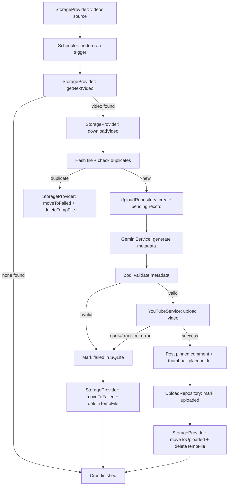
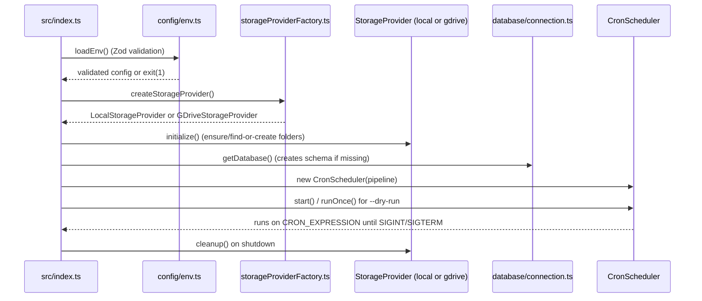
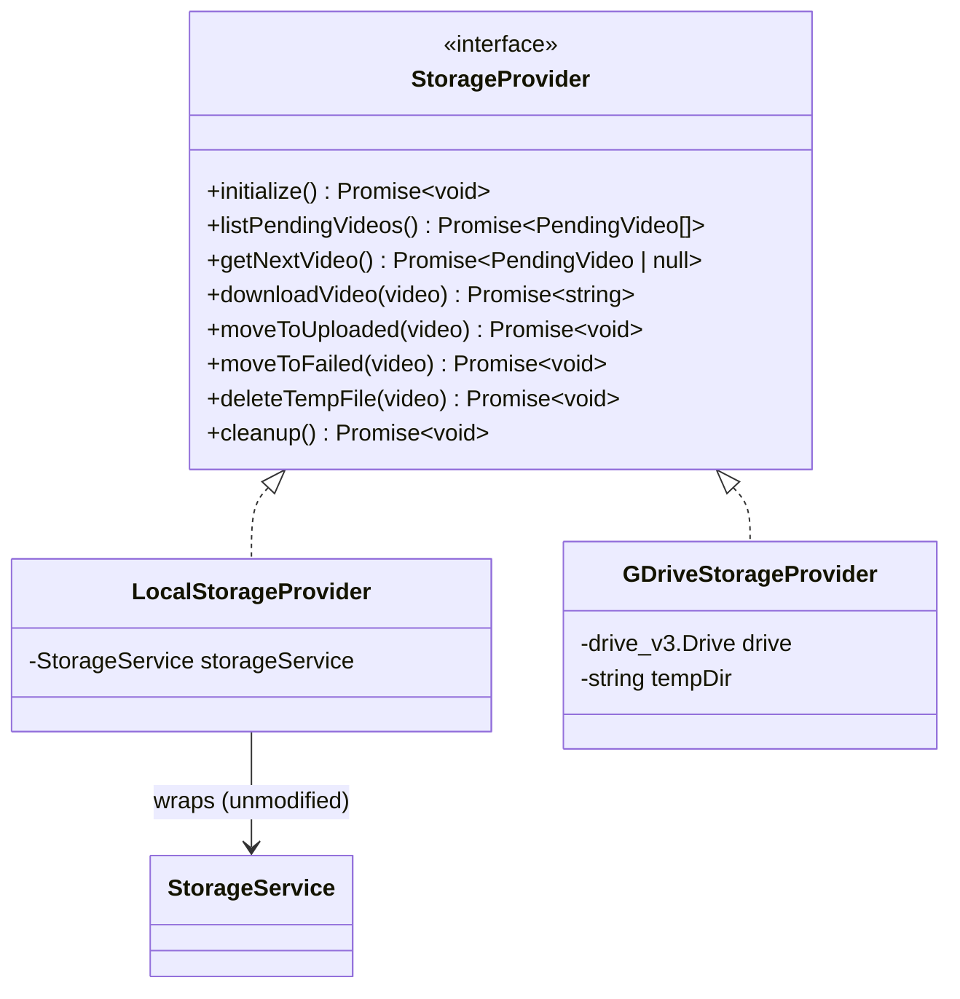

# Application Flow

This document explains the complete workflow of `youtube-ai-automation`,
module by module, with diagrams.

## 1. High-level pipeline



`StorageProvider` is an interface (`src/services/storage/storageProvider.ts`)
with two implementations selected via `STORAGE_PROVIDER`:

- **`LocalStorageProvider`** (default) — wraps the original, unmodified
  `StorageService` and the `videos/`, `uploaded/`, `failed/` folders on disk.
  `downloadVideo()` is a no-op path resolution (the file is already local);
  `deleteTempFile()` is a no-op (there's no separate temp copy — the source
  file itself is moved).
- **`GDriveStorageProvider`** — uses Google Drive folders of the same three
  names. `downloadVideo()` actually downloads the file to a local temp
  directory; `moveToUploaded()`/`moveToFailed()` re-parent the Drive file
  between folders; `deleteTempFile()` removes the local temp copy once
  processing finishes.

The pipeline (`UploadPipeline`) depends only on the `StorageProvider`
interface and contains no branching on which backend is active — see
[Storage abstraction](#storage-abstraction) below.

## 2. Startup sequence



## 3. Module responsibilities

| Module | Responsibility |
|---|---|
| `config/env.ts` | Parses and validates every environment variable with Zod. Single source of truth for configuration; the app refuses to boot with bad config. |
| `database/connection.ts` | Opens (and lazily migrates) the SQLite database. Singleton connection. |
| `database/schema.ts` | Raw SQL for the `uploads` table and its indexes. |
| `database/uploadRepository.ts` | All SQL access, exposed as typed methods (repository pattern). Nothing else in the app writes raw SQL. |
| `services/storage/storageProvider.ts` | The `StorageProvider` interface and `PendingVideo` type. The single contract every storage backend implements and the only thing `UploadPipeline` depends on. |
| `services/storage/storageService.ts` | **Unchanged.** The original local filesystem implementation: finds, filters, and moves video files between `videos/`, `uploaded/`, `failed/`. |
| `services/storage/localStorageProvider.ts` | Adapts `StorageService` to the `StorageProvider` interface. `downloadVideo()`/`deleteTempFile()` are no-ops since local files need no downloading or temp copies. |
| `services/storage/gdriveAuth.ts` | Builds an authenticated OAuth2 client for the Google Drive API from a refresh token, independent of the YouTube OAuth client. |
| `services/storage/gdriveStorageProvider.ts` | Google Drive implementation of `StorageProvider`: finds-or-creates the three folders, lists/paginates files, downloads to a local temp file, moves files by re-parenting, retries transient Drive API errors, cleans up temp files. |
| `services/storage/storageProviderFactory.ts` | Reads `STORAGE_PROVIDER` and constructs the matching provider. The only place in the app that references concrete provider classes. |
| `services/gemini/geminiService.ts` | Calls the Gemini REST API, parses and Zod-validates the JSON metadata response, retries transient failures. |
| `services/gemini/metadataSchema.ts` | Zod schema describing exactly what a valid metadata payload looks like. |
| `prompts/metadataPrompt.ts` | Builds the prompt sent to Gemini. Isolated so prompt tuning never touches service logic. |
| `services/youtube/youtubeAuth.ts` | Builds an authenticated OAuth2 client from the refresh token. |
| `services/youtube/youtubeService.ts` | Uploads videos, posts pinned comments, uploads thumbnails (placeholder), classifies quota vs. transient errors. |
| `scheduler/uploadPipeline.ts` | Orchestrates one full run: get next video → download (via `StorageProvider`) → hash/dedupe → generate metadata → validate → upload → persist → move file → delete temp file. Pure orchestration, no direct API calls and no provider-specific logic of its own. |
| `scheduler/cronScheduler.ts` | Wraps `node-cron`, prevents overlapping runs, supports immediate `runOnce()` for dry-run/manual triggers. |
| `utils/retry.ts` | Generic exponential-backoff retry helper used by the Gemini, YouTube, and Google Drive services. |
| `utils/hash.ts` | SHA-256 file hashing for duplicate detection. |
| `utils/logger.ts` | Structured `pino` logger, pretty-printed to console and written as JSON to `logs/app.log`. Logs which storage provider is active at startup. |
| `types/index.ts` | Shared domain types and a small hierarchy of typed error classes (`AppError` → `MetadataGenerationError`, `YouTubeUploadError`, `StorageError`, `DatabaseError`). |

## Storage abstraction



`UploadPipeline` is constructed with a `storageProvider: StorageProvider`
dependency and calls only interface methods — it has no `if (local) ... else
if (gdrive) ...` branching anywhere. `storageProviderFactory.ts` is the sole
place that reads `STORAGE_PROVIDER` and decides which concrete class to
construct; it also logs the active provider (`Storage Provider: Local` or
`Storage Provider: Google Drive`) at startup.

Because `LocalStorageProvider` only *wraps* `StorageService` rather than
replacing it, the original local-filesystem code path is untouched —
`STORAGE_PROVIDER=local` behaves exactly as it did before this abstraction
was introduced.

## 4. Extension points

- **New AI provider**: implement a class with the same `generateMetadata(filename): Promise<VideoMetadata>` shape as `GeminiService` and inject it into `UploadPipeline` instead. No other code needs to change.
- **New storage backend** (Dropbox, S3, ...): implement the `StorageProvider` interface (`initialize`, `listPendingVideos`, `getNextVideo`, `downloadVideo`, `moveToUploaded`, `moveToFailed`, `deleteTempFile`, `cleanup`) and add a branch in `storageProviderFactory.ts`. `GDriveStorageProvider` is a good template to follow.
- **Thumbnail generation**: `YouTubeService.uploadThumbnail()` already accepts a thumbnail path and calls the correct API — wire a generator to produce that file before calling it.
- **Notifications**: add a new service (e.g. `services/notifications/telegramService.ts`) and call it from `UploadPipeline` after `markUploaded`/on failure.
- **Multiple channels**: parameterize `YouTubeService` with per-channel OAuth clients and run one `UploadPipeline` per channel.

## 5. Dry run

`npm run dry-run` (equivalent to `tsx src/index.ts --dry-run`) runs the
pipeline exactly once, generates and logs metadata, and stops **before**
calling the YouTube upload API — no video is actually uploaded and no
quota is spent. The storage step still runs, so this is also a good way to
verify your storage provider is configured correctly.

### Local storage

```
videos/
  ↓ getNextVideo()
  ↓ downloadVideo() — no-op, file is already local
  ↓ hash + duplicate check
  ↓ generate metadata (Gemini)
  ↓ [dry run stops here — metadata is logged, upload skipped]
  ↓ deleteTempFile() — no-op
videos/  (file untouched, stays in place for a real run later)
```

### Google Drive storage

```
Google Drive "videos" folder
  ↓ getNextVideo() — lists Drive files, picks oldest
  ↓ downloadVideo() — downloads file to a local temp path
  ↓ hash + duplicate check (against the local temp copy)
  ↓ generate metadata (Gemini)
  ↓ [dry run stops here — metadata is logged, upload skipped]
  ↓ deleteTempFile() — local temp copy is deleted
Google Drive "videos" folder  (file untouched, stays in place for a real run later)
```

In both cases, nothing is moved to `uploaded/` or `failed/` during a dry
run, and no data is written to YouTube. The only side effects are: a
`pending` row is created in SQLite (with `generating_metadata` → back to
inspectable state) and, for Google Drive, a temporary local file that is
created and then deleted within the same run.

## 6. Future improvements

See [FUTURE_ROADMAP.md](FUTURE_ROADMAP.md) for the full list — additional
cloud storage integrations, chat notifications, real thumbnail generation,
analytics dashboards, multi-channel support, trend analysis, additional AI
providers, subtitles, and multi-language uploads.
